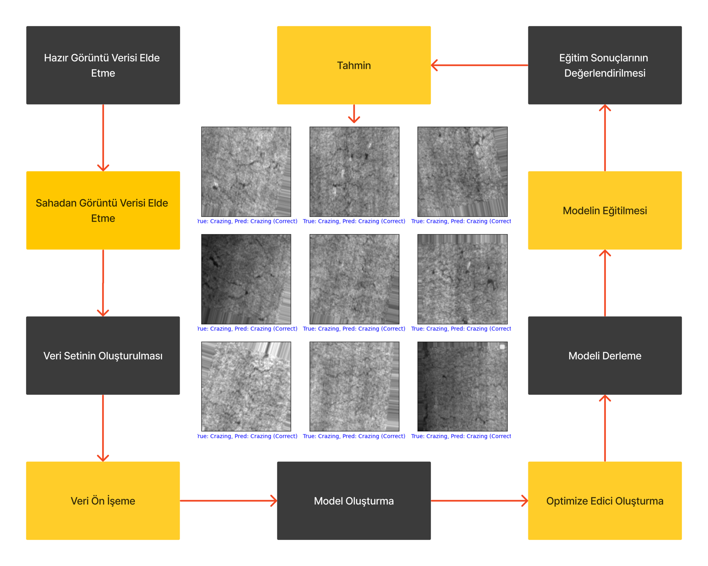
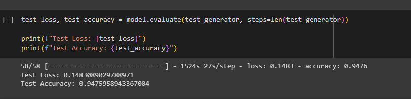
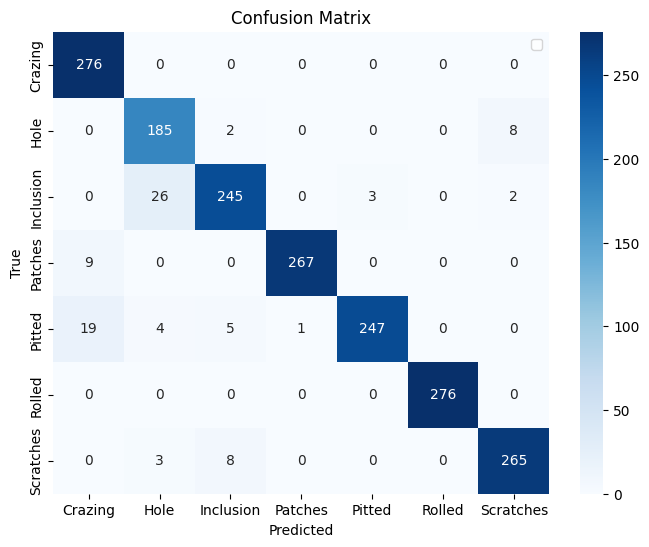
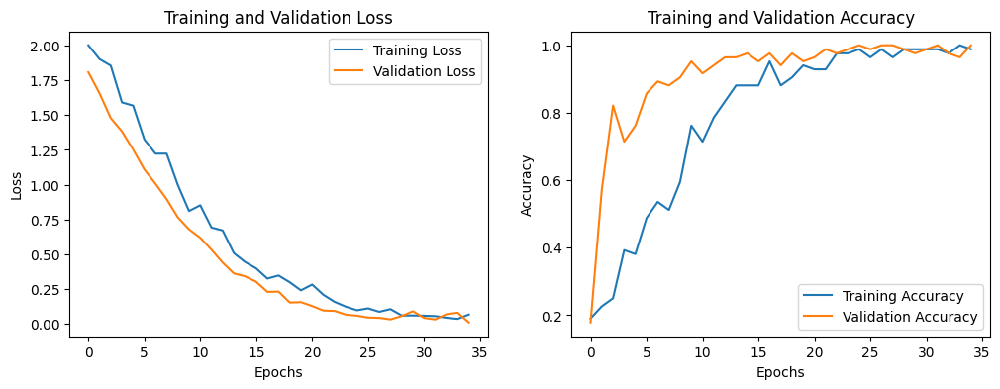

# metal_surface_VGG16

**A Computer Vision System for Surface Defect Detection in Industrial Metals**
(*Endüstriyel Metallerde Yüzey Hatası Tespitine Yönelik Bilgisayarlı Görü Sistemi*)

This repository contains the code of a TÜBİTAK 2209-B funded undergraduate research project (2022–2023). The project classifies steel surface images into 7 defect classes using VGG16 transfer learning. In the reported run, the model was deliberately trained on only **84 images (12 per class)**, validated on 84 images, and tested on **1,851 held-out images**, where it reached **94.75% test accuracy**. The data comes from the public NEU surface defect database plus an additional "Hole" class. This README documents the setup as the code implements it, including its limitations.

## Contents

- [Funding & Supervision](#funding--supervision)
- [Background & Motivation](#background--motivation)
- [Dataset](#dataset)
- [Method](#method)
- [Results](#results)
- [Limitations & Retrospective (2026)](#limitations--retrospective-2026)
- [Follow-up Work](#follow-up-work)
- [Reproducibility](#reproducibility)
- [Repository Structure](#repository-structure)
- [Repository History](#repository-history)
- [AI Assistance](#ai-assistance)
- [License](#license)
- [References](#references)

## Funding & Supervision

| | |
|---|---|
| **Program** | TÜBİTAK 2209-B: Industry-Oriented Undergraduate Research Projects Support Program (2022, 2nd term) |
| **Project period** | 20.12.2022 – 20.12.2023 |
| **Principal Investigator** | Turhan Göksu |
| **Academic Advisor** | Assoc. Prof. Dr. Nida Katı (Fırat University) |
| **Industry Advisor** | Prof. Dr. Fahrettin Yakuphanoğlu (FYTRONIX Elektronik Teknolojileri A.Ş.) |
| **Institutions** | Fırat University, Department of Software Engineering; FYTRONIX Elektronik Teknolojileri A.Ş. (Elazığ Technopark) |

## Background & Motivation

In metal production, surface defects are often found by manual visual inspection. Manual inspection is slow, it depends on the inspector, and it is hard to scale. This project explored whether a pretrained convolutional network (VGG16), fine-tuned on a small number of labeled images, can classify common steel surface defects. The long-term goal was a lightweight model that could run on a mobile device.

## Dataset

The exact dataset copy used in the project (a Google Drive folder, `Metal Surface Defects Data/{train,valid,test}`) is **no longer available**. Everything below comes from the notebook's code and saved outputs.

**Classes (7):** Crazing, Hole, Inclusion, Patches, Pitted, Rolled, Scratches.

- **Six classes** (all except Hole) are consistent with the Kaggle packaging "NEU Metal Surface Defects Data" of the NEU steel surface defect database (Song & Yan, 2013; see [References](#references)). That packaging has 300 images per class, split into `train` 276 / `valid` 12 / `test` 12. The earlier 6-class experiment in this repository used it directly and printed matching counts (1,656 / 72 / 72). **This packaging is no longer available on Kaggle.**
- **Hole** was added by me (219 images in total). **Its source was not documented and could not be recovered.**

**Accessible alternative source:** the NEU images are still available in a different Kaggle packaging, the [NEU Surface Defect Database](https://www.kaggle.com/datasets/kaustubhdikshit/neu-surface-defect-database). This packaging uses a different train/validation split and includes detection annotations, so the split used in this project **cannot be reproduced exactly** from it.

**The roles of the split folders were swapped on purpose.** I wanted to test how well transfer learning works with very little training data, so the code trains on the small folder named `test` and evaluates on the large folder named `train`. The folder names were left unchanged, so in the code they read as swapped:

```python
train_data_dir = '/content/drive/MyDrive/Metal Surface Defects Data/test'   # Found 84 images belonging to 7 classes.
test_data_dir  = '/content/drive/MyDrive/Metal Surface Defects Data/train'  # Found 1851 images belonging to 7 classes.
valid_data_dir = '/content/drive/MyDrive/Metal Surface Defects Data/valid'  # Found 84 images belonging to 7 classes.
```

Assuming the three folders are disjoint, this is **not data leakage**: the model never saw the 1,851 evaluation images during training. The result is a **low-data transfer-learning setup** (12 training images per class) evaluated on a large held-out set.

**Split sizes as used in the code:**

| Class | Train (folder `test`) | Validation (folder `valid`) | Test (folder `train`) |
|---|---:|---:|---:|
| Crazing | 12 | 12 | 276 |
| Hole | 12 | 12 | 195 |
| Inclusion | 12 | 12 | 276 |
| Patches | 12 | 12 | 276 |
| Pitted | 12 | 12 | 276 |
| Rolled | 12 | 12 | 276 |
| Scratches | 12 | 12 | 276 |
| **Total** | **84** | **84** | **1,851** |

The notebook prints only the split totals. The per-class test counts come from the confusion matrix row sums. The per-class train and validation counts assume that the NEU part matches the public packaging (12 per class), which leaves 12 Hole images in each small split.

## Method

As implemented in [`notebooks/metal_surface_vgg16_tubitak_2209b.ipynb`](notebooks/metal_surface_vgg16_tubitak_2209b.ipynb):

- **Input:** RGB images resized to 200×200, pixel values rescaled to [0, 1]. VGG16's ImageNet `preprocess_input` is not used.
- **Augmentation:** `ImageDataGenerator` with rotation (±20°), width/height shift (0.1), and horizontal flip. **The same generator is used for training, validation and test** (see [Limitations](#limitations--retrospective-2026)).
- **Model:** VGG16 (ImageNet weights, `include_top=False`), followed by Flatten → Dense(512, ReLU) → Dropout(0.5) → Dense(7, softmax).
- **Fine-tuning:** all layers trainable (24.2M trainable parameters). The backbone is not frozen.
- **Optimizer:** AdamW from `tensorflow_addons` (learning rate 1e-5, weight decay 1e-4).
- **Loss:** categorical cross-entropy. **Batch size:** 32.
- **Training:** 35 epochs (early stopping configured, not triggered). `EarlyStopping(patience=7, restore_best_weights=True)` and `ModelCheckpoint(save_best_only=True)` both monitor validation loss. The lowest validation loss (0.0097) was reached at the final epoch, so the final weights are also the best-validation-loss weights.
- **Export:** the trained model was saved (`.h5`) and converted to **TensorFlow Lite with dynamic-range quantization** (`tf.lite.Optimize.DEFAULT`).



*Planned project workflow; the field-data acquisition step was not carried out in the code.* The block labels are in Turkish: acquiring existing image data → acquiring field image data → building the dataset → data preprocessing → model construction → optimizer setup → model compilation → model training → evaluation of training results → prediction. The center panel shows example predictions on test images.

## Results

**Test accuracy: 94.75%** on 1,851 held-out images (Keras `model.evaluate()`: `loss: 0.1483 - accuracy: 0.9476`; 1,754 of 1,851 correct).¹



**Per-class test metrics** (from the confusion matrix)²:

| Class | Support | Precision | Recall | F1 |
|---|---:|---:|---:|---:|
| Crazing | 276 | 0.908 | 1.000 | 0.952 |
| Hole | 195 | 0.849 | 0.949 | 0.896 |
| Inclusion | 276 | 0.942 | 0.888 | 0.914 |
| Patches | 276 | 0.996 | 0.967 | 0.982 |
| Pitted | 276 | 0.988 | 0.895 | 0.939 |
| Rolled | 276 | 1.000 | 1.000 | 1.000 |
| Scratches | 276 | 0.964 | 0.960 | 0.962 |
| **Macro average** | 1,851 | 0.950 | 0.951 | **0.949** |

The most frequent confusions are Inclusion → Hole (26), Pitted → Crazing (19), and Patches → Crazing (9). Crazing has perfect recall but lower precision, because other defects are sometimes predicted as Crazing. Hole has the lowest F1, and Inclusion and Pitted have the lowest recall.





¹ The exact `evaluate()` value is 0.947596 (1,754/1,851). The project reported it as 94.75%.
² The confusion matrix comes from a separate `model.predict()` pass over the test set, which gives 95.14% (1,761/1,851). The two passes differ because the test generator applies random augmentation, so each pass sees differently transformed images (7 images differ in net). Because the test generator uses `shuffle=False`, the labels and predictions in the confusion matrix are aligned correctly. The headline number is the `evaluate()` result.

## Limitations & Retrospective (2026)

Looking back at this project with more experience in evaluation methodology:

- **Strength:** the test set is large (1,851 images), so the accuracy estimate is fairly tight (roughly ±1 percentage point, 95% interval). The result is strong for a model trained on 12 images per class. It is still an in-distribution result: training and test images come from the same sources.
- **The validation set is too small.** At 84 images, one error changes validation accuracy by 1.2 points. The 100% validation accuracy at the final epoch is weak evidence: validation accuracy moved between 96.4% and 100% over the last three epochs, and the test accuracy (94.75%) turned out lower.
- **Augmentation at evaluation time.** Validation and test images were randomly augmented, so the reported metrics are slightly stochastic. Today I would use separate rescale-only generators for validation and test.
- **Confusing split naming.** The train/test roles were swapped on purpose, but the folder names were not changed, so the code reads as if training and test data were mixed up. Today I would rename the folders or state the choice explicitly in the notebook.
- **Single run.** An earlier run of the same code (kept in `notebooks/earlier_run_same_code_93.14.ipynb`) reached 93.14% test accuracy, which shows the run-to-run variance that a single number hides.
- **Accuracy-only reporting.** The original write-up reported only accuracy. The per-class metrics above were added for this README.
- **Data provenance gaps.** The source of the Hole class was not documented. X-SDD was the initially planned dataset, but the final experiments used the NEU-based data described above, and the project reports did not keep the two clearly apart.
- **No field evaluation.** No code evaluates the model on images from an industrial production line, so there are no quantitative results on real field data.

**What I would do today:** document every data source and split; use rescale-only generators for evaluation; use a larger, stratified validation set; report macro-F1 and per-class metrics; train with multiple seeds and report mean ± standard deviation; and check what the model relies on with Grad-CAM and intervention tests. I followed this approach in a later project, [rose-disease-classifier](https://github.com/turhanGoksu/rose-disease-classifier).

## Follow-up Work

The model was exported to TensorFlow Lite (dynamic-range quantization) and used in a follow-up mobile application, developed as a team project: [Surface_Anomaly_Detection_Mobile_App](https://github.com/turhanGoksu/Surface_Anomaly_Detection_Mobile_App). Two runs of the notebook wrote to the same file name (`metal_defects_model_quantized2.tflite`), so it is not documented which of the two trained models the app uses.

## Reproducibility

- **The archival notebook** ([`notebooks/metal_surface_vgg16_tubitak_2209b.ipynb`](notebooks/metal_surface_vgg16_tubitak_2209b.ipynb)) is the only source of the reported 7-class result. Its code and saved outputs are preserved unchanged.
- **The Kaggle notebook** ([kaggle.com/code/turhangksu/vgg16-on-neu-steel-defects-6-class-early-run](https://www.kaggle.com/code/turhangksu/vgg16-on-neu-steel-defects-6-class-early-run)) is an earlier 6-class NEU-only experiment (100% on a 72-image test set). It does not reproduce the 7-class result.
- **The exact data cannot be reproduced.** The project's dataset copy and the Kaggle packaging it was based on are no longer available, and the Hole source is undocumented. The NEU images themselves are still available through a different packaging with a different split, so the project's split cannot be recreated exactly (see [Dataset](#dataset)).
- **Environment:** Google Colab, Python 3.10, TensorFlow 2.x, and `tensorflow_addons` 0.23.0 (see [`requirements.txt`](requirements.txt)). `tensorflow_addons` is end-of-life. Current Keras versions provide `AdamW` natively (`keras.optimizers.AdamW`).
- Training was not re-run for this documentation update.

## Repository Structure

```
metal_surface_VGG16/
├── README.md
├── notebooks/
│   ├── metal_surface_vgg16_tubitak_2209b.ipynb   # archival notebook of the reported run (94.75%)
│   ├── earlier_run_same_code_93.14.ipynb         # earlier run of the same code (93.14%)
│   └── earlier_experiment_neu6_kaggle.ipynb      # earlier 6-class NEU-only experiment (Kaggle)
├── docs/figures/                                 # block diagram and figures from the notebook outputs
├── requirements.txt                              # approximate environment
└── LICENSE
```

## Repository History

This repository was originally published under my former GitHub username `Pickardss`.

## AI Assistance

I used ChatGPT as an assistant while writing the code for this project. This documentation was revised in 2026 with the help of an AI assistant (Claude).

## License

The code is released under the [MIT License](LICENSE). The datasets are not part of this repository and are subject to their own licenses and terms of use.

## References

- K. Song and Y. Yan, "A noise robust method based on completed local binary patterns for hot-rolled steel strip surface defects," *Applied Surface Science*, vol. 285, pp. 858–864, 2013.
- K. Simonyan and A. Zisserman, "Very Deep Convolutional Networks for Large-Scale Image Recognition," *ICLR*, 2015.
